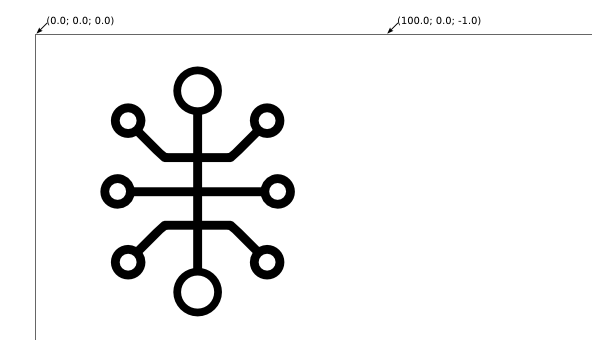

.. role:: menuselection

.. role:: program

.. role:: guilabel

XYPenPlotter eCos demo
======================

This is a repository for the XYPenPlotter demo for the port of `eCos 3.0 RTOS <http://ecos.sourceware.org/>`_ for the `Toradex Colibri VF61 Freescale Vybrid Computer on Module <http://developer.toradex.com/product-selector/colibri-vf61>`_.

The plotter application is a simple example of using Vybrid's Cortex-M4 to control a device in real time and communicate with Linux running on the Cortex-A5 core to drive a GUI which enables the user to select the content being drawn.
The plotter motors are driven by interpreting g-codes generated from SVG image files.

This application is intended to be combined with the XYPenPlotter Linux Qt application running on the Cortex-A5 core `also available from GitHub <https://github.com/toradex/XYPenPlotter>`_.

The eCos application consists of four threads:

* *thread_fn_1* - responsible for generating control signals for the X-Axis step motor
* *thread_fn_2* - responsible for generating control signals for the Y-Axis step motor
* *thread_fn_3* - providing inter-core communication
* *main* thread - the main eCos thread which starts other threads, sets GPIOs and executes drawing instructions from a predefined memory region.
  
This document also gives a brief description about preparing images for the plotter and putting them into memory. 

Compilation
-----------

The compilation can be done using the following steps:

.. code-block:: bash

   cd ecos-colibri-vf61-xypenplotter/src
   vi make.sh
   [use your favourite editor and set toolchain path]
   ./make.sh

This repository already contains a pre-compiled eCos kernel suitable for use with the plotter application.

If a custom eCos kernel is to be used instead, it can be compiled separately and pointed to by the ``BTPATH`` variable.

Preparing images for drawing
----------------------------

``G-code`` is the name of a very popular numerical control (NC) programming language.
This format was chosen for controlling the plotter as there are many aplications supporting conversion of vector graphics into g-codes.

Prerequisites
~~~~~~~~~~~~~

To prepare the graphics and g-codes you need:

1. `Inkscape <http://www.inkscape.org/en/>`_ - fully open source, free and professional vector graphics editor.
   In Debian-like systems you may install Inkscape using:

   .. code-block:: bash 

      sudo apt-get install inkscape

2. Gcodetools plugin for Inkscape.
   More information and an associated installation guide is available on the `plugin website <http://www.cnc-club.ru/forum/viewtopic.php?t=35>`_.
   
Creating g-codes from sample graphics
~~~~~~~~~~~~~~~~~~~~~~~~~~~~~~~~~~~~~

The current distribution consists of an already prepared svg file with a properly assigned center for the coordinate system.
We recommend to use this file as reference for further work.

To generate such a file from scratch, it is good to refer to the documentation provided with the g-code generator plugin to make sure that the transformation is correct.
Failing to do so may cause the plotting head to drive beyond the physical drawing area which may lead to damage in the plotter's mechanical assembly. 

Launch Inkscape and open the reference image named ``gcode.svg`` from the ``tools`` folder. 
This file has a starting point for the coordinate systems assigned; it is in the top left corner of the drawing area. Although the used coordinate system seems to be wrong, it is correct. Other coordinate systems cause the generate a g-codes which are incorrectly interpreted by the plotter application. As a result the image may be drawn in the wrong place or the pen will not be lowered for drawing.

This will be called the ``home`` position for plotter.

By default the plotter starts and ends drawing in the ``home`` position.

It is now time to release your creativity - draw something.
Your Inkscape window should look similar to the figure below. 

Now select all the elements of your image (excluding coordinate systems) and group them (:menuselection:`Object --> Group`).
Next, convert the object to path with :menuselection:`Path --> Object to path`.
Lastly, choose :menuselection:`Extensions --> Gcodetools --> Path to gcode`.
Switch to the :guilabel:`Preferences` tab and edit the :guilabel:`Directory` to decide where to save your g-codes (directory must exist).
Next select the :menuselection:`Path to Gcode` tab and click :menuselection:`Apply`.

Before you use the g-code file generated this way to drive the plotter, you have to convert them to a binary file suitable for placing in memory, so that eCos will be able to read it.

The default approach assumes that the whole set of g-codes is placed in memory before the drawing process begins.
Then eCos software starts reading the memory and executing the g-code commands one by one. 

.. warning:: 
   
   Currently only a basic set of g-codes is implemented. The plotter is able to execute the following gcodes:
   
   * G00 - Rapid linear move
   * G01 - Feed linear move
   * G02 - Circular move CW (Arcs only)
   * G03 - Circular move CCW (Arcs only)
   * G04 - Delay

Creating the binary file
~~~~~~~~~~~~~~~~~~~~~~~~

The ``g2b.py`` Python script in the ``tools`` directory converts the g-codes file to the binary file that needs to be placed into memory.
It is executed as follows:

.. code-block:: bash 

   ./python g2b.py <ngc_filename>
   
The script creates an ``image.bin`` output binary file from an ``.ngc`` file created by Inkscape.
This file includes values from your g-code file.

Every instruction is divided into 7 fields:

.. csv-table::
   :header: Position, Field, Type, Description

   1,GCode, INT, G-code number
   2,X value, FLOAT, Position in X Axis
   3,Y value, FLOAT, Position in Y Axis
   4,Z value, FLOAT, Position in Z Axis
   5,I value, FLOAT, Center of circle in X Axis
   6,J value, FLOAT, Center of circle in Y Axis
   7,Parameter value, INT, Additional parameter (Delay)
   
If a g-code has no value for a parameter its value is set to ``0xffffffff``.

Preparing the system to run the application
-------------------------------------------

Currently the image data is loaded into the DRAM memory space which must be separated from the Linux memory space.
This prevents image data corruption by applications running in the Cortex-A5 Linux.

To do this you have to reduce the default memory size assigned to Linux, which may be obtained by modifying the Linux boot arguments at U-Boot.

Start your system and enter U-Boot, then type

.. code-block:: bash 

   set memargs mem=240M
   save
   reset

This will shrink the DDR memory available for Linux into 240MB leaving a 16MB buffer for storing image data shared between Linux and eCos.

Running the plotter application and assigning the drawing task
--------------------------------------------------------------

While eCos on Vybrid can also be run directly from U-Boot, this eCos application is intended to be be launched from Linux user space as it needs to be supplied with image data to be drawn.
The recommended way is to use the :program:`mqxboot` utility.
This program simply loads the eCos binary into RAM memory, sets the entry point and starts the Cortex-M core.
The utility comes from the Freescale MQX operating system but it may be used as a stand-alone loader for virtually any software dedicated for Vybrid's Cortex-M core. 

Use the following command to start loading eCos from user-space. 

.. code-block:: bash 
   
   mqxboot plotter.bin 0x8f000400 0x0f000411
   
This should cause the ``plotter.bin`` application to run and an appropriate welcome message should be printed to predefined diagnostic (UART) port.
The application is now working in the background silently and waiting for a drawing assignment. 
We may use the same loading utility (:program:`mqxboot`) to load the image data into memory.
In that case the entry point is not important, as the application is already running. 

.. code-block:: bash 
   
   mqxboot image.bin 0x8FA00000 0x0
   
The final step requires issuing a ``Start`` command to the eCos application.
There are two ways to do it which involve two different inter-core communication protocols, both of which are described below.
   
Inter-core communication protocols
----------------------------------

The XYPenPlotter demo application may be controlled in two ways:

* via shared memory 
* via MCC (Multi Core Communication)

These methods are used to control the software executed on the Cortex-M core from the Cortex-A Linux application.
The communication method is determined from the value of the ``USING_MCC`` constant defined in the source code.
If such a definition appears in the code, the latter method is used, if not, the former is selected.

The list of usable commands for the application is unified (i.e. the same order codes are sent either by MCC or shared memory and the responses should also be the same).
The order code uniquely defines the state of plotting device.

A list of currently supported orders is provided below:

.. csv-table::
   :header: Comand/Status code,Interpretation as Command, Interpretation as Status
   
   0, Stop, Stopped
   1, Continue (when paused), Running
   2, Start drawing from memory, Start drawing command received
   9, "Unpause - same as Start, needed for MCC", Unpause command received
   10, Pause, Paused
   11, "Calibrate - Find home(0,0)", Calibrating
   12, "Welcome, Needed for MCC", Welcome message received

Communication via shared memory
~~~~~~~~~~~~~~~~~~~~~~~~~~~~~~~

For the shared memory communication, three 32bit registers are used. 

.. csv-table::
   :header: Position,Address,Description
   
   1, 0x8F9FFFF4, "eCos sets this register to ``0xDEADBEEF`` soon after start"
   2, 0x8F9FFFF8, "Command code. Described below"
   3, 0x8F9FFFFC, "First (least significant) two bytes: Progress (0-100); Last (more significant) two bytes: Status (same as command)"
   
Shared memory is the simplest way of inter-core communication.
Cortex-M has free access to the entire memory map (including DDR where Linux will be loaded), so the user space application has to write to given address to transfer data.
In the current implementation the order code is placed at ``0x8F9FFFF8``.
The ``devmem2`` utility can be used on the Linux side, which should be available in your Colibri VF61 Linux distribution.
The following example sends a single order from the Cortex-A Linux user space to eCos running on the Cortex-M core. 

.. code-block:: bash 
   
   devmem2 0x8F9FFFF8 w 2

The first parameter is the address to be accessed.
The second one is the register type, namely ``b`` for byte, ``h`` for half word, ``w`` for word.
Finally the last argument is the value to be written.

If the last parameter is omitted then ``devmem2`` performs a single read operation.
We can use the same method to determine the state of the eCos application. 

.. code-block:: bash

   devmem2 0x8F9FFFFC w

The first example should cause the application to start drawing whereas the latter should return the current drawing status.

Using MCC
~~~~~~~~~

MCC (Multi Core Communiation) is a message-based protocol developed for the Vybrid processor for exchanging data between applications running on both cores simultaneously.
It uses inter-core interrupts, dedicated mechanisms for synchronization, data validation etc. 
In the XYPenPlotter demo application the MCC approach may be used for controlling the eCos application from Linux.

To enable this option you should define ``USING_MCC`` constant in the source code and recompile the application. 
By default the MCC framework is made up of two components: communication structure and endpoints. 

Endpoints
"""""""""

Each endpoint represents a buffer for sending and receiving messages.
Each endpoint must have a unique address assigned.
These addresses are used for dispatching messages. 

A typical Endpoint declarations looks as follows:

.. code-block:: c

   MCC_ENDPOINT    endpoint_a5 = {0,MCC_NODE_A5,MCC_SENDER_PORT};
   MCC_ENDPOINT    endpoint_m4 = {1,MCC_NODE_M4,MCC_RESPONDER_PORT};

Communication structure
"""""""""""""""""""""""

After declaring the endpoints it is mandatory to define the message format.
In the basic approach the message passed between endpoints will have a fixed structure.
For the XYPenPlotter application such message is structured in the following way. 

.. code-block:: c

   typedef struct the_message
   {
      cyg_uint32  DATA;
      cyg_uint32  STATUS;
   } THE_MESSAGE;
   
   THE_MESSAGE msg, smsg;

For messages sent from the Linux application the *DATA* field contains the order code and *STATUS* is not used. 
In response, the Linux application gets messages from eCos with the same structure with *DATA* holding the drawing progress and *STATUS* expressing the current state of the drawing device.

MCC initialization
""""""""""""""""""

Before the communication may be established the MCC module must be initialized.
The same operation must be performed for both sides of communication channel (i.e. eCos on Cortex-M and the user space application in Linux on Cortex-A).

For the Cortex-M node, use:

.. code-block:: c

   ret_value = mcc_initialize(MCC_NODE_M4);
   
``ret_value`` will be equal to one of the following values:

.. csv-table::
   :header: Value, Definition, Description
   
   0, MCC_SUCCESS, function returned successfully
   1, MCC_ERR_TIMEOUT, blocking function timed out before completing
   2, MCC_ERR_INVAL, invalid input parameter
   3, MCC_ERR_NOMEM, out of shared memory for message transmission
   4, MCC_ERR_ENDPOINT, invalid endpoint / endpoint doesn't exist
   5, MCC_ERR_SEMAPHORE, semaphore handling error
   6, MCC_ERR_DEV, Device Open Error
   7, MCC_ERR_INT, Interrupt Error
   8, MCC_ERR_SQ_FULL, Signal queue is full
   9, MCC_ERR_SQ_EMPTY, Signal queue is empty
   
The same error codes relate to all MCC functions.
The next step is to create an entry point and make is visible for the other core. 

.. code-block:: c

   ret_value = mcc_create_endpoint(endpoint_m4, MCC_RESPONDER_PORT);
   
After that stage the MCC communication is established and it is now possible to send and receive data. 

Receiving a message
"""""""""""""""""""

In order to receive a message you have to use the function ``mcc_recv_copy`` which is responsible for receiving a message from the incoming buffer and copying it to the previously defined message data structure.
An example use case of this function is provided below:

.. code-block:: c

   ret_value = mcc_recv_copy(endpoint_m4, &msg, sizeof(THE_MESSAGE), &num_of_received_bytes, 50000);

If the return code is ``MCC_SUCCESS`` the received data is available in the fields of the msg structure.
From the Cortex-M side the *DATA* field will contain the order code whereas the STATUS field is not used. 
The Cortex-M core should respond by sending the MCC message with current drawing progress and plotting status.
Hence the use case for sending a MCC message from Cortex-M may look like this:

.. code-block:: c

   ret_value = mcc_send(endpoint_a5, &smsg, sizeof(THE_MESSAGE), 50000);

If the return value is equal to ``MCC_SUCCESS``, it means that the data is ready to be received by the Linux application. 
